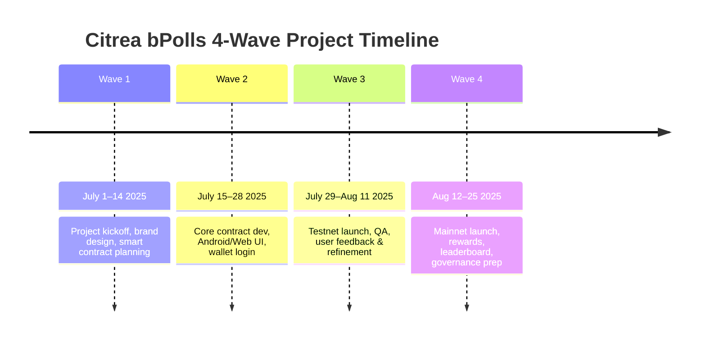

```mermaid
timeline
    title Citrea bPolls 4-Wave Project Timeline

    Wave 1: July 1–14 2025 : Project kickoff, brand design, smart contract planning
    Wave 2: July 15–28 2025 : Core contract dev, Android/Web UI, wallet login
    Wave 3: July 29–Aug 11 2025 : Testnet launch, QA, user feedback & refinement
    Wave 4: Aug 12–25 2025 : Mainnet launch, rewards, leaderboard, governance prep

```